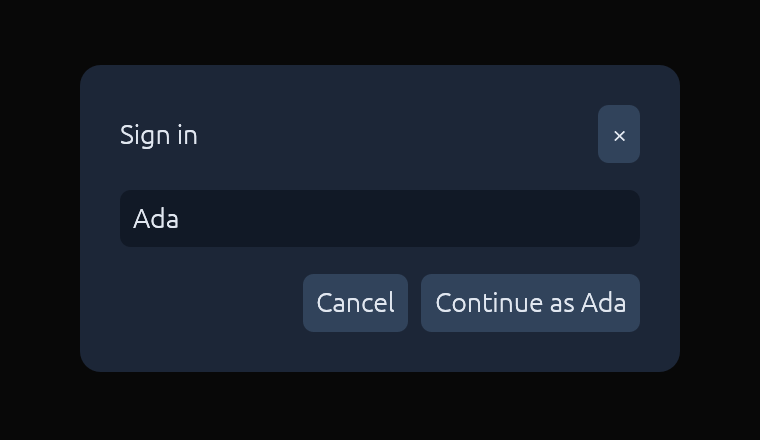

# dgui

**Immediate mode and a DOM tree at the same time.**



Immediate-mode GUIs are pleasant to write. You call functions, the UI
appears, and nothing has to be kept in sync. But they lay out in a single
pass, so "center this", "push that to the right edge" or "wrap these cards"
are awkward or impossible. Retained-mode GUIs and DOMs handle layout well, but
you pay with diffing, reconciliation, virtual DOMs and invalidation.

dgui does neither. **Every frame, your code builds the whole tree from
scratch. dgui lays it out with real flexbox ([Taffy]), draws it with [egui],
and throws it away.** It doesn't diff or patch anything, and nothing gets
invalidated. Since the tree exists before anything is drawn, layout can see
every node, and since it's rebuilt every frame, you write ordinary
immediate-mode code.

Rebuilding everything every frame isn't *that* slow:

| Workload (CPU per frame) | plain egui | dgui |
|---|---:|---:|
| calculator, 20 buttons | 25 µs | 75 µs |
| 1,000 buttons | 1.1 ms | 3.5 ms |
| 10,000 buttons | 12 ms | 61 ms |

dgui costs about 3× as much as plain egui, and a typical screen still takes
microseconds. When you really do have thousands of rows, `Frame::virtual_list`
builds only the visible ones.

## Example

This is the dialog in the screenshot:

```rust
use dgui::{Align, Color, Direction, Frame, Justify, Length, Ui, button, text_input};

fn sign_in<'a>(ui: &mut Ui<'_, 'a>) -> Frame<'a> {
    let name = ui.state("name", || String::from("Ada"));

    Frame::new()
        .width(Length::Percent(1.0))
        .height(Length::Percent(1.0))
        .align(Align::Center)
        .justify(Justify::Center)
        .children(move |ui| {
            ui.add(Frame::new().width(360.0).padding(24.0).gap(16.0)
                .background(Color::rgb(28, 38, 55)).corner_radius(12)
                .children(move |ui| {
                    ui.add(Frame::new().direction(Direction::Row)
                        .justify(Justify::SpaceBetween).align(Align::Center)
                        .children(|ui| {
                            ui.add(Frame::text("Sign in"));
                            ui.add(button("×"));
                        }));
                    ui.add(text_input(name));
                    ui.add(Frame::new().direction(Direction::Row)
                        .justify(Justify::End).gap(8.0)
                        .children(move |ui| {
                            ui.add(button("Cancel"));
                            ui.add(button(format!("Continue as {}", name.get()))
                                .on_click(move || println!("hello, {}", name.get())));
                        }));
                }));
        })
}

// In your eframe app, with egui's `max_passes = 1`:
self.gui.show(ui, |ui| {
    ui.scope("sign_in", |ui| {
        let frame = sign_in(ui);
        ui.add(frame);
    });
});
```

To make that work:

- **Everything is a `Frame`**: a flexbox box that can hold children, text, an
  egui canvas or event handlers.
- **State is keyed, not retained.** `ui.state(key, init)` returns a `Copy`
  handle that lives as long as its enclosing `ui.scope(key, …)`. When a scope
  isn't built in a frame, it unmounts and its state is dropped.
- **Callbacks run after drawing.** `on_click` and friends fire once the whole
  tree is laid out and painted, so the tree never changes while it's being
  built. State writes show up in the next frame.
- **Scopes own async tasks** (`ui.tasks()`), and those tasks are dropped
  when the scope unmounts.

## Running the examples

```sh
cargo run --example sign_in
cargo run --example demo
```

[Taffy]: https://github.com/DioxusLabs/taffy
[egui]: https://github.com/emilk/egui
