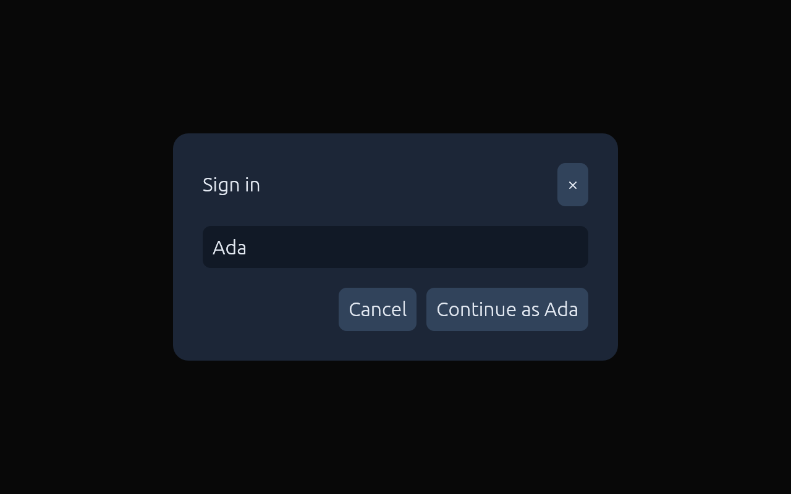
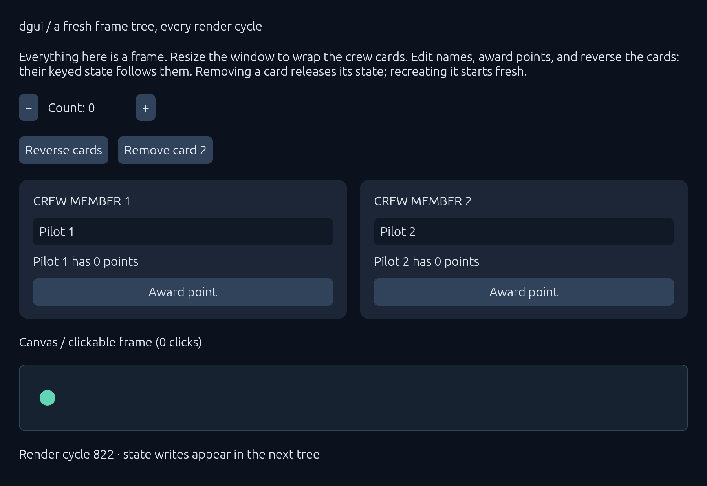
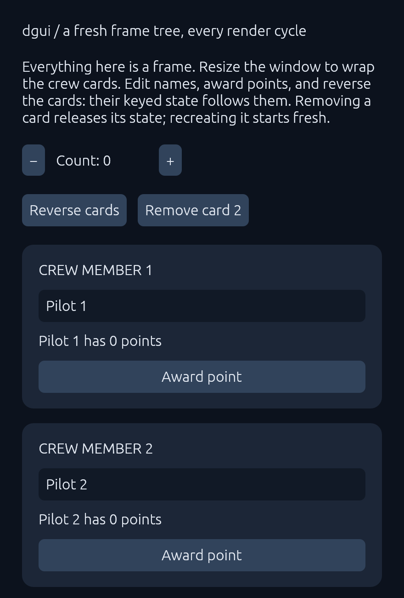

# dgui

**Flexbox layout for egui, without giving up immediate mode.**

dgui lets you lay out egui apps the way you'd lay out a web page: rows and
columns, `gap`, `padding`, `justify`, `align`, `grow`, `wrap`, percentages. You
still rebuild the whole UI from plain Rust every frame, borrow your data
directly, and use egui's widgets, text and painter wherever you want.

```rust
use dgui::{Align, Color, Direction, Frame, Justify, Length, Ui, button, text_input};

fn sign_in<'a>(ui: &mut Ui<'_, 'a>) -> Frame<'a> {
    let name = ui.state("name", || String::from("Ada"));

    // Fill the window and center the dialog on both axes.
    Frame::new()
        .width(Length::Percent(1.0))
        .height(Length::Percent(1.0))
        .align(Align::Center)
        .justify(Justify::Center)
        .children(move |ui| {
            ui.add(
                Frame::new()
                    .width(360.0)
                    .max_width(Length::Percent(0.9))
                    .padding(24.0)
                    .gap(16.0)
                    .background(Color::rgb(28, 38, 55))
                    .corner_radius(12)
                    .children(move |ui| {
                        // Title on the left, close button pinned to the right.
                        ui.add(
                            Frame::new()
                                .direction(Direction::Row)
                                .justify(Justify::SpaceBetween)
                                .align(Align::Center)
                                .children(|ui| {
                                    ui.add(Frame::text("Sign in"));
                                    ui.add(button("×"));
                                }),
                        );
                        ui.add(text_input(name));
                        // Actions hug the right edge, whatever their labels say.
                        ui.add(
                            Frame::new()
                                .direction(Direction::Row)
                                .justify(Justify::End)
                                .gap(8.0)
                                .children(move |ui| {
                                    ui.add(button("Cancel"));
                                    ui.add(
                                        button(format!("Continue as {}", name.get()))
                                            .on_click(move || println!("hello, {}", name.get())),
                                    );
                                }),
                        );
                    }),
            );
        })
}
```

<p align="center">
  
</p>

If you've written CSS, you can read that without the docs. Doing the same in
plain egui (centering a box of unknown size, right-aligning a button whose
label changes as you type) usually means measuring last frame's sizes or
running a hidden sizing pass.

```sh
cargo run --example sign_in   # the dialog above
cargo run --example demo      # wrapping cards, keyed state, a canvas
```

## Why this is nice

### Real layout, still immediate mode

egui lays out each widget as it draws it, in a single pass. That's what makes
it so simple, and it's also why "center this", "push that to the right" and
"wrap these cards onto the next line" are hard: when a widget is placed, its
later siblings haven't been measured yet.

dgui splits each render cycle into three steps:

1. **Build**: your code runs and produces a tree of frames.
2. **Lay out**: [Taffy](https://github.com/DioxusLabs/taffy), the flexbox
   engine behind Bevy UI and Dioxus, sizes everything, measuring text and
   custom content as it goes.
3. **Draw**: frames are painted and made interactive through ordinary egui.

The tree is thrown away afterwards. Nothing is retained or diffed, and there
are no signals or subscriptions to manage. It still feels like egui, but every
frame knows its final size before anything is drawn. The result is ready in
the same egui pass, with no "wrong for one frame" flicker.

### The CSS you already know

| CSS                                  | dgui                                         |
| ------------------------------------ | -------------------------------------------- |
| `display: flex; flex-direction: row` | `.direction(Direction::Row)` / `Style::row()` |
| `flex-wrap: wrap`                    | `.wrap(true)`                                |
| `gap: 12px`                          | `.gap(12.0)`                                 |
| `padding`, `margin`                  | `.padding(16.0)`, `.margin(8.0)`             |
| `justify-content: space-between`     | `.justify(Justify::SpaceBetween)`            |
| `align-items: center`                | `.align(Align::Center)`                      |
| `flex-grow: 1; flex-shrink: 0`       | `.grow(1.0).shrink(0.0)`                     |
| `width: 100%; max-width: 250px`      | `.width(Length::Percent(1.0)).max_width(250.0)` |
| `min-width`, `min-height`, `max-height` | `.min_width(..)`, `.min_height(..)`, `.max_height(..)` |
| `background`, `border`, `border-radius` | `.background(..)`, `.border(1.0, ..)`, `.corner_radius(8)` |
| `:hover`, `:active`, `:focus` backgrounds | `.hover_background(..)`, `.active_background(..)`, `.focus_background(..)` |
| `overflow: hidden`                   | always on                                    |

Sizes use `box-sizing: border-box`. Responsive layouts come for free. A row of
fixed-width, growable cards wraps onto new lines as the window narrows, with
no breakpoints or resize code:

```rust,ignore
ui.frame(Style::row().wrap(true).gap(16.0), |ui| {
    for crew in &crew_members {
        ui.add(Frame::new().width(250.0).grow(1.0).padding(18.0).children(...));
    }
});
```

<p align="center">
  
  &nbsp;
  
</p>
<p align="center"><sub>The same code at 900px and 440px wide. The cards wrap and the text reflows.</sub></p>

### Everything is a `Frame`

dgui has no widget trait, separate button type, or container/leaf split.
Containers, text, buttons, text inputs and custom canvases are all the same
type, with the same styling and event methods:

```rust,ignore
Frame::new()                       // a container
Frame::text("Hello")               // wrapping text
button("Save")                     // a focusable, pre-styled frame with a label
text_input(name)                   // a frame wrapping egui's TextEdit
Frame::egui_canvas([200.0, 60.0], |ui| { /* any egui code */ })
```

So a button can have any layout you like. It's just a frame:

```rust,ignore
button("")
    .direction(Direction::Row)
    .gap(8.0)
    .children(|ui| {
        ui.add(icon());
        ui.add(Frame::text("Upload"));
        ui.add(Frame::new().grow(1.0)); // spacer
        ui.add(Frame::text("Ctrl+U"));
    })
```

Any frame can be clicked, hovered or focused. Put `.on_click(...)` on a
card, a row, or a canvas and it becomes a hit target, with no `Sense` or
`interact` plumbing. `.focusable(true)` makes it reachable with Tab and
activatable with Enter/Space.

### Components are functions, state is a `Copy` handle

A component is a function that returns a `Frame`. It can ask for state keyed to
its scope, similar to React hooks but without the hook-ordering rules, since
state is looked up by key:

```rust,ignore
fn counter<'a>(ui: &mut Ui<'_, 'a>) -> Frame<'a> {
    let count = ui.state("count", || 0);
    Frame::new()
        .direction(Direction::Row)
        .gap(12.0)
        .align(Align::Center)
        .children(move |ui| {
            ui.add(button("−").on_click(move || count.update(|n| *n -= 1)));
            ui.add(Frame::text(format!("Count: {}", count.get())));
            ui.add(button("+").on_click(move || count.update(|n| *n += 1)));
        })
}

// Each scope gets its own state:
for id in [1, 2, 3] {
    ui.scope(id, |ui| {
        let frame = counter(ui);
        ui.add(frame);
    });
}
```

`State<T>` is `Copy` for any `T`, so you can move it into as many closures as
you like without `Rc<RefCell<…>>` or cloning. State follows its key: reorder
the list and each counter keeps its count, and a focused text field keeps its
focus and selection. Drop a scope from the build and its state is freed. Bring
it back and it starts fresh.

### Callbacks that just borrow

Event handlers are plain `FnOnce` closures that can **borrow anything that
lives for the frame**, like your app struct or a local `Vec`. There is no
message enum and no `'static` bound. They run after the whole tree has been
drawn, in order, so every frame sees the same consistent snapshot of your
data and no handler mutates it mid-draw.

### egui is still right there

- dgui renders into any `&mut egui::Ui`. Use it for the whole window, or just
  one panel of an existing egui app.
- `Frame::egui_canvas(size, |ui| ...)` hands you a plain `egui::Ui` sized and
  clipped by flexbox. Plots, sliders, `painter()` calls and third-party egui
  widgets all work inside it.
- Text uses egui's fonts and galleys. `text_input` is egui's `TextEdit`.
- For full control, `Frame::canvas(measure, draw)` lets custom content report
  its own size to the layout engine, including width-dependent heights, and
  route native egui responses into the frame's `on_click`/`on_focus` handlers.

## Getting started

Keep a `Dgui` in your app and call `show` once per render cycle:

```rust,ignore
struct App {
    gui: dgui::Dgui,
}

impl eframe::App for App {
    fn ui(&mut self, host: &mut egui::Ui, _frame: &mut eframe::Frame) {
        self.gui.show(host, |ui| {
            ui.scope("sign_in", |ui| {
                let frame = sign_in(ui);
                ui.add(frame);
            });
        });
    }
}

```

The runtime supports repeated egui passes. Build and draw on every pass;
callbacks and keyed canvas effects dispatch once per interaction per displayed
frame. Effects are not rolled back if egui discards a pass. Applications should
queue consequential actions and apply them after the host's pass loop. Scopes
visited in any pass stay mounted until the following frame boundary.

`Dgui` and `State<T>` support `Send + Sync`; stored values must satisfy both
bounds. Frame closures can still borrow local data and need not be `Send`.

The root frame fills the host's available rectangle as a column. See
[`examples/demo.rs`](examples/demo.rs) for a complete app with wrapping cards,
keyed state that follows reordering, mounting and unmounting, and an animated,
clickable canvas.

For content-sized roots, call `show_styled(host, Style::column()
.width(Length::Percent(1.0)), build)`. The runtime determines the automatic
height from the contents. Add `.overflow_y(Overflow::Scroll)` to a bounded
frame to give it a scrolling viewport; children keep their natural size,
and nested scroll containers route wheel input through egui.

`Frame::virtual_list(count, row_height, key, build_row)` uses that same frame
model for large lists. Only visible rows and two rows of overscan are built.
Keep selection and drafts in application data because offscreen rows unmount.

## Good to know

- **Lengths** are logical pixels. `Length::Percent(1.0)` means 100%. Padding,
  margin and border width are uniform on all sides, and margins don't collapse.
- **Clipping**: frames clip children to their rectangle. Corner radius rounds
  the background and border, but clipping is still rectangular.
- **Keys**: sibling scope keys must be unique. Wrap anything conditional or
  reorderable in `ui.scope(key, ...)`, because unkeyed frames are identified by
  position.
- **State timing**: state writes made in callbacks show up in the next tree.
  Avoid mutating state while building, so each tree comes from one consistent
  snapshot.
- **Borrowing `ui` twice**: store a component's frame in a local before
  `ui.add(frame)`, since `ui.add(counter(ui))` borrows `ui` twice.

## Status

dgui is an early prototype targeting native desktop. It includes declarative
scrolling, fixed-height virtualization, inherited disabled state, and frame
response hooks. Multiline editors, application typography, and specialized
graphics can use native canvas leaves. It has no animation or gamepad navigation
API; the convenience text constructor uses a fixed 16px font. Its performance
has not been benchmarked yet.

```sh
cargo test
cargo clippy --all-targets -- -D warnings
cargo fmt --check
```
